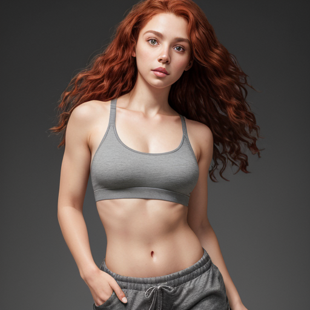
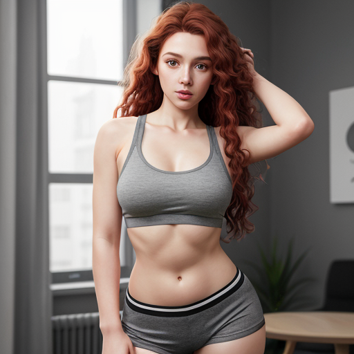
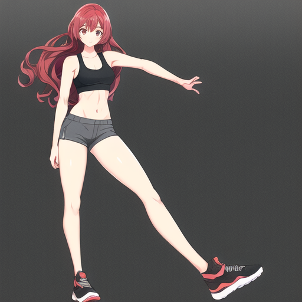
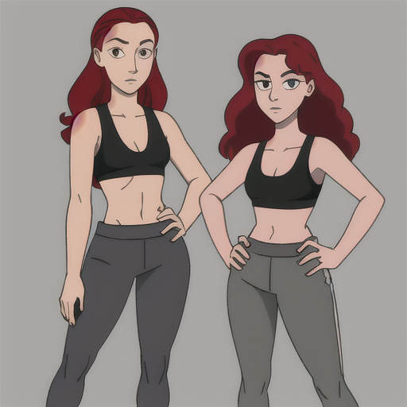
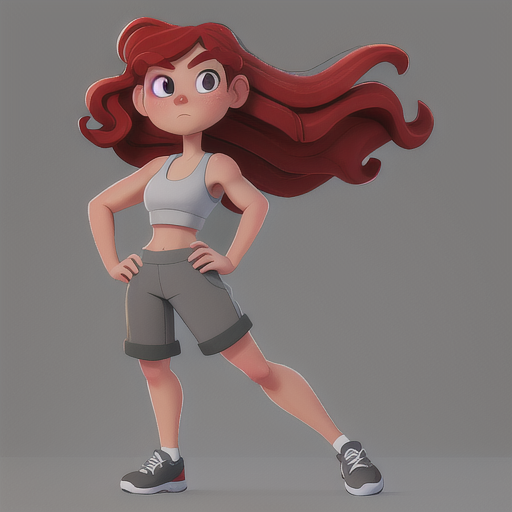
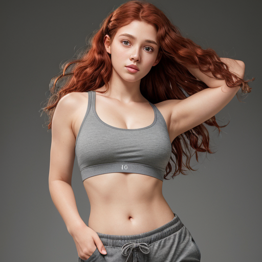

# Prompt Cheatsheet: Body types Across AI Models

**Template**: `photorealistic, soft lighting, full body, 8k resolution, 25yo woman, solo, attractive, gray eyes, long curly red hair,  natural face, grey closed sport bra, grey shorts, open waist, neutral expression, balanced proportions,  clean background, <<positive>>
`

---

| Body types | [Photon X EpicRealism](https://civitai.com/models/652785/photon-x-epicrealism) | [Anime Anything](https://civitai.com/models/113841/animeanything-or) | [Cute Cartoon Illustration](https://civitai.com/models/85547/cute-cartoon-illustration) | [Western Cartoon Type A](https://civitai.com/models/62060/western-cartoon-type-a) |
|----------|:--------:|:--------:|:--------:|:--------:|
| Slim  Description: `A slender and graceful body type with low body fat.` Keywords: `((slim body type)), lean, delicate frame` |  |  |  |  |
| Athletic  Description: `A strong and fit body with visible muscle tone.` Keywords: `((athletic body type)), toned muscles, fit physique` |  |  |  |  |
| Muscular  Description: `A heavily muscled and strong physique.` Keywords: `((muscular body type)), defined muscles, powerful build` |  |  |  |  |
| Curvy  Description: `A voluptuous figure with noticeable curves.` Keywords: `((curvy body type)), full hips and bust, defined waist` |  |  |  |  |
| Pear_shaped  Description: `A body with more volume in hips compared to upper body.` Keywords: `((pear-shaped body)), wider hips, narrower shoulders` |  |  |  |  |
| Apple_shaped  Description: `A body type with a rounder torso and slimmer limbs.` Keywords: `((apple-shaped body)), fuller midsection, slimmer legs` |  |  |  |  |
| Rectangular  Description: `A body with similar width at bust, waist, and hips.` Keywords: `((rectangular body type)), straight silhouette, balanced proportions` |  |  |  |  |
| Hourglass  Description: `A classic silhouette with a defined waist and proportionate curves.` Keywords: `((hourglass body type)), narrow waist, balanced bust and hips` |  |  |  |  |
| Plus_size  Description: `A larger and fuller body type with soft curves.` Keywords: `((plus-size body)), fuller figure, soft curves` |  |  |  |  |
| Petite  Description: `A small and compact body frame.` Keywords: `((petite body)), small frame, short stature` |  |  |  |  |
| Stocky  Description: `A compact and powerful body type with broad features.` Keywords: `((stocky body)), short and solid build, broad shoulders` |  |  |  |  |
| Lean_muscular  Description: `A body with defined muscles but slender build.` Keywords: `((lean muscular body)), toned and defined with low fat` |  |  |  |  |
| Broad_shoulders  Description: `Wide shoulders indicating strength or athleticism.` Keywords: `((broad shoulders)), strong upper body` |  |  |  |  |
| Narrow_waist  Description: `A slim and well-defined waistline.` Keywords: `((narrow waist)), defined midsection` |  |  |  |  |
| Long_legs  Description: `Legs that are proportionally longer than average.` Keywords: `((long legs)), elongated lower body` |  |  |  |  |
| Short_legs  Description: `Legs that appear shorter relative to the torso.` Keywords: `((short legs)), compact lower body` |  |  |  |  |
| Broad_hips  Description: `Wide hips giving a pronounced lower body shape.` Keywords: `((broad hips)), wide lower body` |  |  |  |  |
| Narrow_hips  Description: `Slim hips providing a straighter silhouette.` Keywords: `((narrow hips)), slim lower body` |  |  |  |  |
| Defined_abs  Description: `A toned midsection with clearly visible muscles.` Keywords: `((defined abs)), visible abdominal muscles` |  |  |  |  |
| Soft_midsection  Description: `A body with soft curves and less muscle definition.` Keywords: `((soft midsection)), gentle curves, less defined muscles` |  |  |  |  |
| Broad_chest  Description: `A wide and powerful chest region.` Keywords: `((broad chest)), muscular upper body` |  |  |  |  |
| Narrow_chest  Description: `A slender chest with less width.` Keywords: `((narrow chest)), slim upper body` |  |  |  |  |
| Broad_back  Description: `A strong, wide back indicating strength.` Keywords: `((broad back)), muscular and strong` |  |  |  |  |
| Narrow_back  Description: `A lean back with narrow width.` Keywords: `((narrow back)), slim and lean` |  |  |  |  |
| Rounded_shoulders  Description: `Shoulders with a gentle roundness.` Keywords: `((rounded shoulders)), relaxed posture` |  |  |  |  |
| Square_shoulders  Description: `Angular shoulders with a square appearance.` Keywords: `((square shoulders)), strong and angular` |  |  |  |  |
| Toned_arms  Description: `Arms showing muscle tone and definition.` Keywords: `((toned arms)), muscular definition in arms` |  |  |  |  |
| Soft_arms  Description: `Arms with a smooth, less muscular appearance.` Keywords: `((soft arms)), gentle curves, less muscle tone` |  |  |  |  |