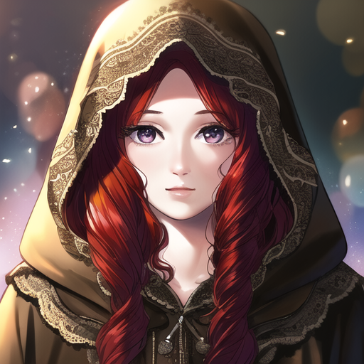
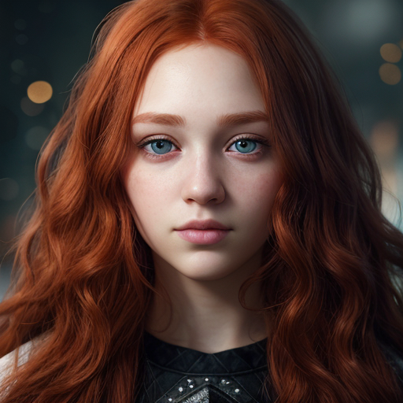
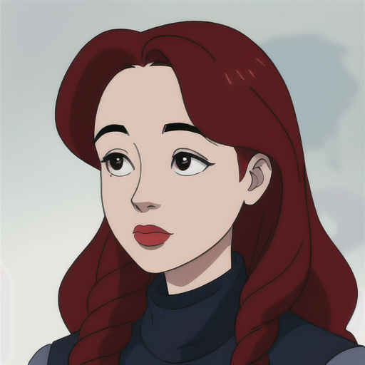

# Prompt Cheatsheet: Eye shapes Across AI Models

**Template**: `photorealistic, soft lighting, shallow depth of field, high quality, 8k resolution, close-up, portrait, 25yo, woman, attractive, beautiful, long curly red hair, round face shape, head facing forward, <<positive>>
`

---

| Eye shapes | [Photon X EpicRealism](https://civitai.com/models/652785/photon-x-epicrealism) | [Anime Anything](https://civitai.com/models/113841/animeanything-or) | [Cute Cartoon Illustration](https://civitai.com/models/85547/cute-cartoon-illustration) | [Western Cartoon Type A](https://civitai.com/models/62060/western-cartoon-type-a) |
|----------|:--------:|:--------:|:--------:|:--------:|
| Almond  Description: `Classic almond eyes with balanced width and height.` Keywords: `((almond-shaped eyes)), slightly upturned outer corners` |  |  |  |  |
| Round  Description: `Large and circular eyes with high visibility.` Keywords: `((round eyes)), large, open` |  |  |  |  |
| Monolid  Description: `Eyes with a flat, smooth eyelid and no visible crease.` Keywords: `((monolid eyes)), smooth eyelid without crease` |  |  |  |  |
| Hooded  Description: `A low brow bone with skin that folds down.` Keywords: `((hooded eyes)), soft eyelid crease, heavy lid` |  |  |  |  |
| Upturned  Description: `Eyes that lift upward toward the outer edge.` Keywords: `((upturned eyes)), higher outer corners` |  |  |  |  |
| Downturned  Description: `Eyes that slope slightly downward at the outer corners.` Keywords: `((downturned eyes)), outer corners dip downward` |  |  |  |  |
| Wide_set  Description: `Eyes spaced farther apart than average.` Keywords: `((wide-set eyes)), more space between eyes` |  |  |  |  |
| Close_set  Description: `Eyes positioned closer together on the face.` Keywords: `((close-set eyes)), short distance between inner corners` |  |  |  |  |
| Small  Description: `Compact and narrow eyes.` Keywords: `((small eyes)), narrow, subtle` |  |  |  |  |
| Large  Description: `Big and expressive eyes with wide opening.` Keywords: `((large eyes)), expressive, wide` |  |  |  |  |