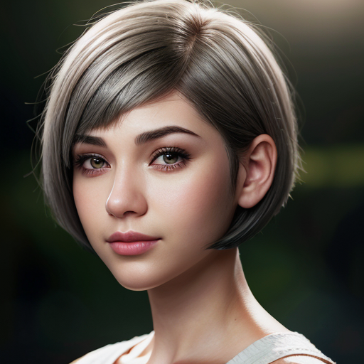
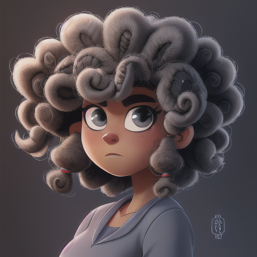

# Prompt Cheatsheet: Hairstyle Across AI Models

**Template**: `photorealistic, soft lighting, shallow depth of field, high quality, 8k resolution, close-up, portrait, 25yo, woman, attractive, beautiful, gray eyes, looking at the viewer, <<positive>>
`

---

| Hairstyle | [Photon X EpicRealism](https://civitai.com/models/652785/photon-x-epicrealism) | [Anime Anything](https://civitai.com/models/113841/animeanything-or) | [Cute Cartoon Illustration](https://civitai.com/models/85547/cute-cartoon-illustration) | [Western Cartoon Type A](https://civitai.com/models/62060/western-cartoon-type-a) |
|----------|:--------:|:--------:|:--------:|:--------:|
| Long_straight  Description: `Straight and flowing long hair.` Keywords: `((long straight hair)), sleek, shiny` |  |  |  |  |
| Long_wavy  Description: `Long hair with natural soft waves.` Keywords: `((long wavy hair)), soft waves` |  |  |  |  |
| Long_curly  Description: `Bouncy, spiral curls with length.` Keywords: `((long curly hair)), voluminous curls` |  |  |  |  |
| Shoulder_length  Description: `Hair that reaches just to the shoulders.` Keywords: `((shoulder-length hair)), neat, balanced` |  |  |  |  |
| Short_bob  Description: `A fashionable bob cut ending at the chin.` Keywords: `((short bob cut)), chin-length, clean lines` |  |  |  |  |
| Pixie_cut  Description: `Very short, edgy and modern hairstyle.` Keywords: `((pixie cut)), very short, modern` |  |  |  |  |
| Braided  Description: `Hair styled in one or more braids.` Keywords: `((braided hair)), single braid, neat style` |  |  |  |  |
| Ponytail  Description: `Hair pulled back and tied at the crown or nape.` Keywords: `((high ponytail)), tied back, clean` |  |  |  |  |
| Bun  Description: `Hair styled in a neat bun on top or back of head.` Keywords: `((hair in a bun)), neat updo` |  |  |  |  |
| Afro  Description: `A naturally curly and voluminous afro.` Keywords: `((afro hairstyle)), dense curls, voluminous` |  |  |  |  |
| Mohawk  Description: `A bold style with shaved sides and upright hair strip.` Keywords: `((mohawk hairstyle)), shaved sides, bold center strip` |  |  |  |  |