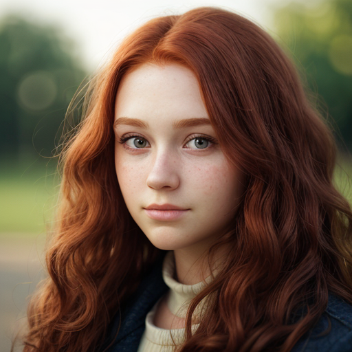
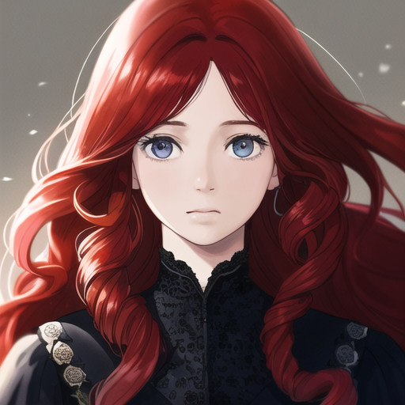

# Prompt Cheatsheet: Mouth shapes Across AI Models

**Template**: `photorealistic, soft lighting, shallow depth of field, high quality, 8k resolution, close-up, portrait, 25yo, woman, attractive, beautiful, long curly red hair, round face shape, head facing forward, looking at the viewer, <<positive>>
`

---

| Mouth shapes | [Photon X EpicRealism](https://civitai.com/models/652785/photon-x-epicrealism) | [Anime Anything](https://civitai.com/models/113841/animeanything-or) | [Cute Cartoon Illustration](https://civitai.com/models/85547/cute-cartoon-illustration) | [Western Cartoon Type A](https://civitai.com/models/62060/western-cartoon-type-a) |
|----------|:--------:|:--------:|:--------:|:--------:|
| Full_lips  Description: `Plump and well-defined lips with volume.` Keywords: `((full lips)), plump, defined shape` |  |  |  |  |
| Thin_lips  Description: `Narrow lips with refined contours.` Keywords: `((thin lips)), delicate, subtle` |  |  |  |  |
| Heart_shaped_lips  Description: `Lips with a pronounced cupid’s bow and fullness.` Keywords: `((heart-shaped lips)), cupid’s bow accentuated` |  |  |  |  |
| Wide_smile  Description: `A broad mouth expression showing happiness.` Keywords: `((wide smile)), broad, joyful` |  |  |  |  |
| Small_mouth  Description: `A compact and dainty mouth shape.` Keywords: `((small mouth)), neat proportions` |  |  |  |  |
| Downturned_mouth  Description: `Mouth corners that dip slightly downward.` Keywords: `((downturned mouth corners)), subtle sadness` |  |  |  |  |
| Upturned_mouth  Description: `Corners of the mouth that lift subtly.` Keywords: `((upturned mouth corners)), gentle smile` |  |  |  |  |
| Prominent_cupid_bow  Description: `A deeply defined upper-lip curve.` Keywords: `((pronounced cupid’s bow)), defined shape` |  |  |  |  |
| Full_lower_lip  Description: `A noticeably plumped lower lip.` Keywords: `((full lower lip)), plump bottom lip` |  |  |  |  |
| Bow_shaped_lips  Description: `Lips that resemble a bow with upward curves.` Keywords: `((bow-shaped lips)), curved upper lip` |  |  |  |  |
| Wide_pout  Description: `A pouty look with width and fullness.` Keywords: `((wide pout)), fuller lips across mouth` |  |  |  |  |
| Neutral_lips  Description: `Lips in a neutral, calm state.` Keywords: `((neutral lips)), relaxed, natural` |  |  |  |  |