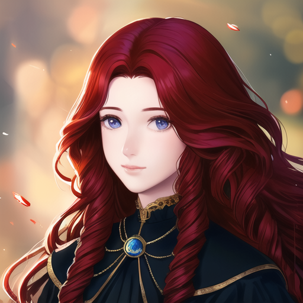
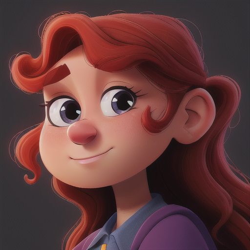
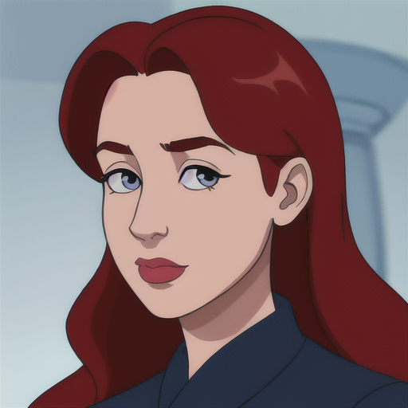
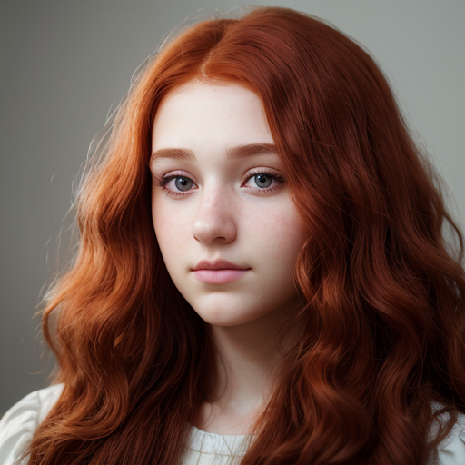

# Prompt Cheatsheet: Nose shapes Across AI Models

**Template**: `photorealistic, soft lighting, shallow depth of field, high quality, 8k resolution, close-up, portrait, 25yo, woman, attractive, beautiful, long curly red hair, round face shape, head facing forward, looking at the viewer, <<positive>>
`

---

| Nose shapes | [Photon X EpicRealism](https://civitai.com/models/652785/photon-x-epicrealism) | [Anime Anything](https://civitai.com/models/113841/animeanything-or) | [Cute Cartoon Illustration](https://civitai.com/models/85547/cute-cartoon-illustration) | [Western Cartoon Type A](https://civitai.com/models/62060/western-cartoon-type-a) |
|----------|:--------:|:--------:|:--------:|:--------:|
| Straight  Description: `A straight and symmetrical nose profile.` Keywords: `((straight nose)), balanced bridge, proportional` |  |  |  |  |
| Aquiline  Description: `A distinguished nose with a gentle curve.` Keywords: `((aquiline nose)), slight curve or hook` |  |  |  |  |
| Upturned  Description: `A nose where the tip tilts slightly upward.` Keywords: `((upturned nose)), slight tilt upward` |  |  |  |  |
| Downturned  Description: `A nose with a gently descending tip.` Keywords: `((downturned nose)), slight tilt downward` |  |  |  |  |
| Button  Description: `A cute and compact nose with a rounded tip.` Keywords: `((button nose)), small, rounded tip` |  |  |  |  |
| Broad  Description: `A strong nasal structure with width and character.` Keywords: `((broad nose)), wide bridge and nostrils` |  |  |  |  |
| Narrow  Description: `An elegant and slim nasal structure.` Keywords: `((narrow nose)), thin bridge, refined` |  |  |  |  |
| Flat  Description: `A nose with minimal bridge projection.` Keywords: `((flat nose)), low bridge` |  |  |  |  |
| Hooked  Description: `A prominent curved profile giving character.` Keywords: `((hooked nose)), pronounced curved bridge` |  |  |  |  |
| Bulbous  Description: `A nose with a pronounced rounded tip.` Keywords: `((bulbous nose)), rounded, full tip` |  |  |  |  |
| High_bridge  Description: `A nose with elevated central ridge.` Keywords: `((high nasal bridge)), elevated bridge` |  |  |  |  |
| Low_bridge  Description: `A softer, flatter nose bridge.` Keywords: `((low nasal bridge)), shallow profile` |  |  |  |  |