--- 

| Emotion |                         [Photon X EpicRealism](https://civitai.com/models/652785/photon-x-epicrealism)                          |                          [Anime Anything](https://civitai.com/models/113841/animeanything-or)                          |                   [Cute Cartoon Illustration](https://civitai.com/models/85547/cute-cartoon-illustration)                    |                         [Western Cartoon Type A](https://civitai.com/models/62060/western-cartoon-type-a)                         |
|----------|:-------------------------------------------------------------------------:|:--------------------------------------------------------------------:|:------------------------------------------------------------------:|:--------------------------------------------------------------------------:|
| laughing Positive: `1` Keywords: `((laughing joyfully)), (open mouth), (expressive eyes), (wide smile)` |            |      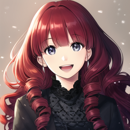      |      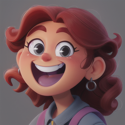      |      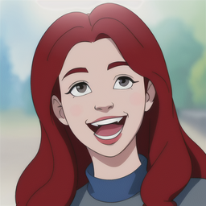      |
| smiling Positive: `1` Keywords: `((smiling softly)), (gentle smile), (kind eyes)` |              |       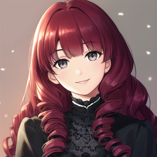       |       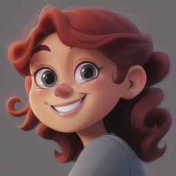       |              |
| shy Positive: `1` Keywords: `((shy expression)), (lowered gaze), (slight smile), (timid posture)` |                      |           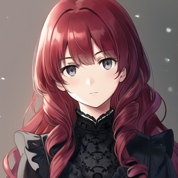           |           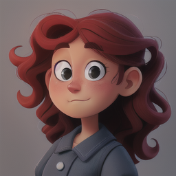           |           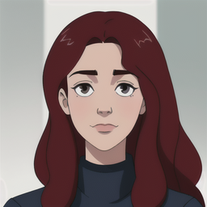           |
| seductive Positive: `1` Keywords: `((seductive gaze)), (half-lidded eyes), (smirking), (tempting posture)` |          |     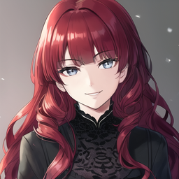     |     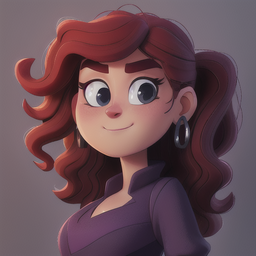     |          |
| angry Positive: `1` Keywords: `((angry expression))` |                  |         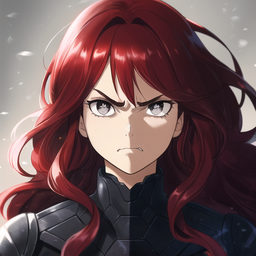         |                  |         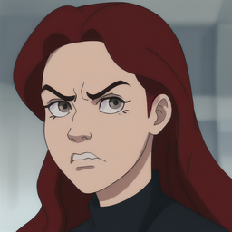         |
| sad Positive: `1` Keywords: `((sad expression))` |                      |           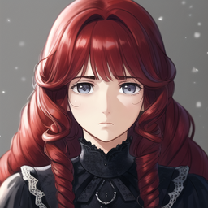           |           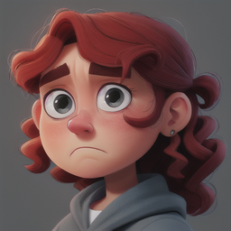           |           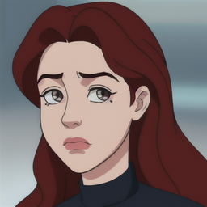           |
| surprised Positive: `1` Keywords: `((surprised expression))` |          |     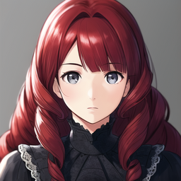     |     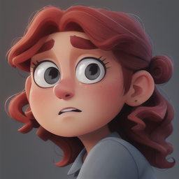     |          |
| confused Positive: `1` Keywords: `((confused expression))` |            |            |      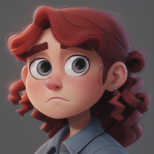      |      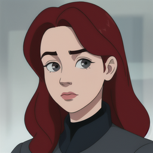      |
| bored Positive: `1` Keywords: `((bored expression))` |         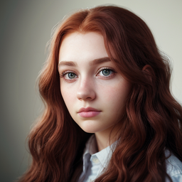         |         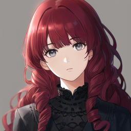         |         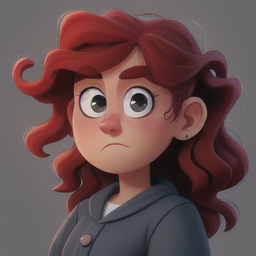         |         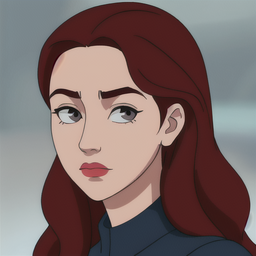         |
| excited Positive: `1` Keywords: `((excited expression))` |              |       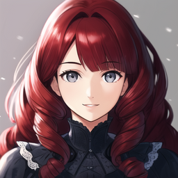       |       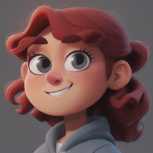       |              |
| worried Positive: `1` Keywords: `((worried expression))` |              |       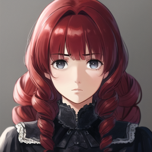       |       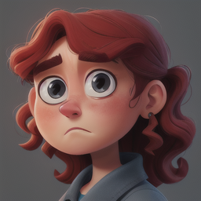       |              |
| determined Positive: `1` Keywords: `((determined expression))` |        |    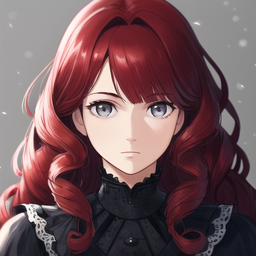    |    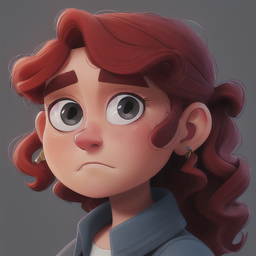    |    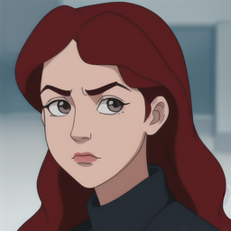    |
| disgusted Positive: `1` Keywords: `((disgusted expression))` |          |     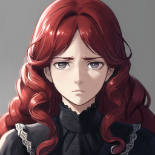     |     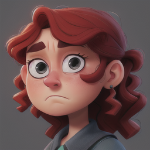     |          |
| relaxed Positive: `1` Keywords: `((relaxed expression))` |              |       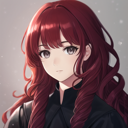       |       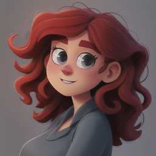       |       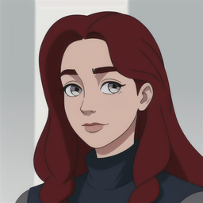       |
| tired Positive: `1` Keywords: `((tired expression))` |                  |         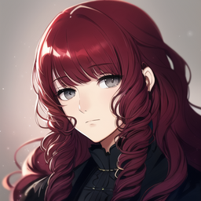         |         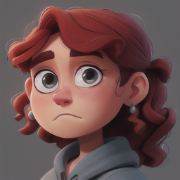         |                  |
| sleepy Positive: `1` Keywords: `((sleepy expression))` |                |        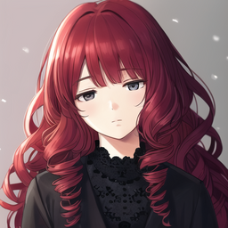        |        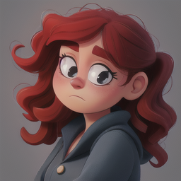        |        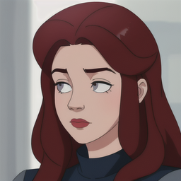        |
| peaceful Positive: `1` Keywords: `((peaceful expression))` |            |      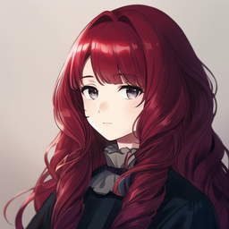      |      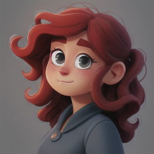      |      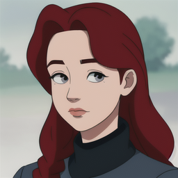      |
| hopeful Positive: `1` Keywords: `((hopeful expression))` |              |       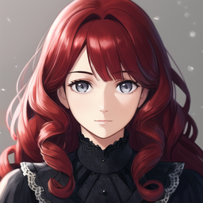       |       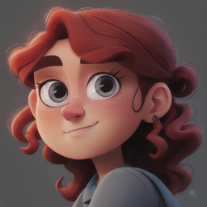       |              |
| lonely Positive: `1` Keywords: `((lonely expression))` |                |        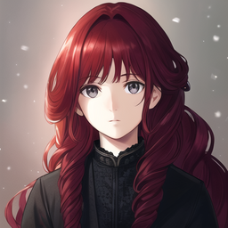        |        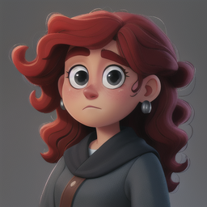        |        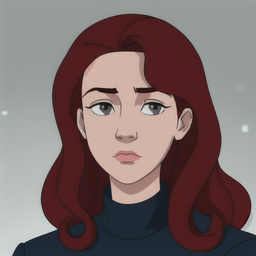        |
| embarrassed Positive: `1` Keywords: `((embarrassed expression))` |   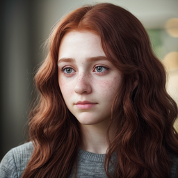   |   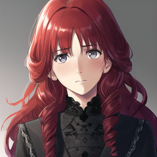   |      |      |
| ashamed Positive: `1` Keywords: `((ashamed expression))` |              |              |              |              |
| guilty Positive: `1` Keywords: `((guilty expression))` |                |                |                |                |
| proud Positive: `1` Keywords: `((proud expression))` |                  |                  |                  |                  |
| grateful Positive: `1` Keywords: `((grateful expression))` |            |            |            |            |
| nostalgic Positive: `1` Keywords: `((nostalgic expression))` |          |          |          |          |
| melancholy Positive: `1` Keywords: `((melancholy expression))` |        |        |        |        |
| playful Positive: `1` Keywords: `((playful expression))` |              |              |              |              |
| sarcastic Positive: `1` Keywords: `((sarcastic expression))` |          |          |          |          |
| serious Positive: `1` Keywords: `((serious expression))` |              |              |              |              |
| sassy Positive: `1` Keywords: `((sassy expression))` |                  |                  |                  |                  |
| flirty Positive: `1` Keywords: `((flirty expression))` |                |                |                |                |
| stern Positive: `1` Keywords: `((stern expression))` |                  |                  |                  |                  |
| innocent Positive: `1` Keywords: `((innocent expression))` |            |            |            |            |
| curious Positive: `1` Keywords: `((curious expression))` |              |              |              |              |
| thoughtful Positive: `1` Keywords: `((thoughtful expression))` |        |        |        |        |
| focused Positive: `1` Keywords: `((focused expression))` |              |              |              |              |
| panicked Positive: `1` Keywords: `((panicked expression))` |            |            |            |            |
| terrified Positive: `1` Keywords: `((terrified expression))` |          |          |          |          |
| disoriented Positive: `1` Keywords: `((disoriented expression))` |      |      |      |      |
| skeptical Positive: `1` Keywords: `((skeptical expression))` |          |          |          |          |
| bashful Positive: `1` Keywords: `((bashful expression))` |              |              |              |              |
| cheerful Positive: `1` Keywords: `((cheerful expression))` |            |            |            |            |
| dreamy Positive: `1` Keywords: `((dreamy expression))` |                |                |                |                |
| friendly Positive: `1` Keywords: `((friendly expression))` |            |            |            |            |
| jealous Positive: `1` Keywords: `((jealous expression))` |              |              |              |              |
| mischievous Positive: `1` Keywords: `((mischievous expression))` |      |      |      |      |
| nervous Positive: `1` Keywords: `((nervous expression))` |              |              |              |              |
| puzzled Positive: `1` Keywords: `((puzzled expression))` |              |              |              |              |
| raging Positive: `1` Keywords: `((raging expression))` |                |                |                |                |
| ecstatic Positive: `1` Keywords: `((ecstatic expression))` |            |            |            |            |
| content Positive: `1` Keywords: `((content expression))` |              |              |              |              |
| grinning Positive: `1` Keywords: `((grinning expression))` |            |            |            |            |
| amused Positive: `1` Keywords: `((amused expression))` |                |                |                |                |
| affectionate Positive: `1` Keywords: `((affectionate expression))` |    |    |    |    |
| joyful Positive: `1` Keywords: `((joyful expression))` |                |                |                |                |
| eager Positive: `1` Keywords: `((eager expression))` |                  |                  |                  |                  |
| inspired Positive: `1` Keywords: `((inspired expression))` |            |            |            |            |
| radiant Positive: `1` Keywords: `((radiant expression))` |              |              |              |              |
| relieved Positive: `1` Keywords: `((relieved expression))` |            |            |            |            |
| calm Positive: `1` Keywords: `((calm expression))` |                    |                    |                    |                    |
| serene Positive: `1` Keywords: `((serene expression))` |                |                |                |                |
| inviting Positive: `1` Keywords: `((inviting expression))` |            |            |            |            |
| compassionate Positive: `1` Keywords: `((compassionate expression))` |  |  |  |  |
| warm Positive: `1` Keywords: `((warm expression))` |                    |                    |                    |                    |
| optimistic Positive: `1` Keywords: `((optimistic expression))` |        |        |        |        |
| pragmatic Positive: `1` Keywords: `((pragmatic expression))` |          |          |          |          |
| balanced Positive: `1` Keywords: `((balanced expression))` |            |            |            |            |
| motivated Positive: `1` Keywords: `((motivated expression))` |          |          |          |          |
| confident Positive: `1` Keywords: `((confident expression))` |          |          |          |          |
| smug Positive: `` Keywords: `((smug expression))` |                    |                    |                    |                    |
| cold Positive: `` Keywords: `((cold expression))` |                    |                    |                    |                    |
| resentful Positive: `` Keywords: `((resentful expression))` |          |          |          |          |
| judgmental Positive: `` Keywords: `((judgmental expression))` |        |        |        |        |
| apathetic Positive: `` Keywords: `((apathetic expression))` |          |          |          |          |
| aloof Positive: `` Keywords: `((aloof expression))` |                  |                  |                  |                  |
| hostile Positive: `` Keywords: `((hostile expression))` |              |              |              |              |
| irritated Positive: `` Keywords: `((irritated expression))` |          |          |          |          |
| impatient Positive: `` Keywords: `((impatient expression))` |          |          |          |          |
| manic Positive: `` Keywords: `((manic expression))` |                  |                  |                  |                  |
| manipulative Positive: `` Keywords: `((manipulative expression))` |    |    |    |    |
| paranoid Positive: `` Keywords: `((paranoid expression))` |            |            |            |            |
| intimidating Positive: `` Keywords: `((intimidating expression))` |    |    |    |    |
| mocking Positive: `` Keywords: `((mocking expression))` |              |              |              |              |
| sorrowful Positive: `` Keywords: `((sorrowful expression))` |          |          |          |          |
| devastated Positive: `` Keywords: `((devastated expression))` |        |        |        |        |
| vengeful Positive: `` Keywords: `((vengeful expression))` |            |            |            |            |
| furious Positive: `` Keywords: `((furious expression))` |              |              |              |              |
| hateful Positive: `` Keywords: `((hateful expression))` |              |              |              |              |
| arrogant Positive: `` Keywords: `((arrogant expression))` |            |            |            |            |
| snide Positive: `` Keywords: `((snide expression))` |                  |                  |                  |                  |
| petulant Positive: `` Keywords: `((petulant expression))` |            |            |            |            |
| weary Positive: `` Keywords: `((weary expression))` |                  |                  |                  |                  |
| withdrawn Positive: `` Keywords: `((withdrawn expression))` |          |          |          |          |
| tense Positive: `` Keywords: `((tense expression))` |                  |                  |                  |                  |
| disturbed Positive: `` Keywords: `((disturbed expression))` |          |          |          |          |
| detached Positive: `` Keywords: `((detached expression))` |            |            |            |            |
| rejected Positive: `` Keywords: `((rejected expression))` |            |            |            |            |
| horrified Positive: `` Keywords: `((horrified expression))` |          |          |          |          |
| defeated Positive: `` Keywords: `((defeated expression))` |            |            |            |            |

--- 
