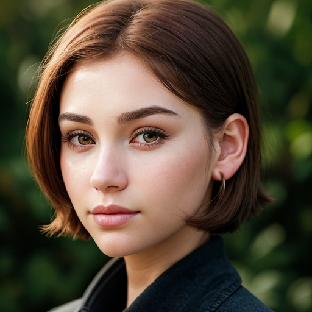

# Prompt Cheatsheet: Face shapes Across AI Models

**Template**: `photorealistic, ultra-detailed close-up portrait of a beautiful 25-year-old woman, soft lighting, shallow  depth of field, 8k resolution, gray eyes, very short red hair tucked behind ears, (no bangs:1.2), soft jawline,  round cheeks, balanced facial proportions, natural skin texture, head facing forward,  looking directly at the viewer, centered composition, clean background, cinematic lighting,  <<positive>>`

---

| Face shape | [Photon X EpicRealism](https://civitai.com/models/652785/photon-x-epicrealism) | [Anime Anything](https://civitai.com/models/113841/animeanything-or) | [Cute Cartoon Illustration](https://civitai.com/models/85547/cute-cartoon-illustration) | [Western Cartoon Type A](https://civitai.com/models/62060/western-cartoon-type-a) |
|----------|:--------:|:--------:|:--------:|:--------:|
| Oval_face  Description: `A classic and balanced oval-shaped face.` Keywords: `((oval face shape)), balanced proportions, soft jawline` |  |  |  |  |
| Heart_face  Description: `A face shape with a broad forehead and narrow chin, like a heart.` Keywords: `((heart-shaped face)), wider forehead, pointed chin, slender jawline` |  |  |  |  |
| Square_face  Description: `A bold and angular face with a square jaw and equal proportions.` Keywords: `((square face shape)), strong jawline, broad forehead` |  |  |  |  |
| Round_face  Description: `A soft and circular face with a rounded jaw and full cheeks.` Keywords: `((round face shape)), soft features, full cheeks, curved jawline` |  |  |  |  |
| Long_face  Description: `An elongated face shape with more vertical length.` Keywords: `((long face shape)), elongated proportions, narrow width` |  |  |  |  |
| Diamond_face  Description: `A narrow forehead and chin with high cheekbones forming a diamond shape.` Keywords: `((diamond-shaped face)), narrow forehead, pointed chin, wide cheekbones` |  |  |  |  |
| Triangular_face  Description: `A broad jaw with a tapering forehead like an inverted triangle.` Keywords: `((triangular face shape)), broad jawline, narrow forehead` |  |  |  |  |
| Inverted_triangle_face  Description: `A face with a wide top narrowing to a small chin.` Keywords: `((inverted triangle face)), broad forehead, narrow chin` |  |  |  |  |
| Pear_face  Description: `A bottom-heavy face with a broad jawline and narrower forehead.` Keywords: `((pear-shaped face)), wider jaw, narrow forehead` |  |  |  |  |
| Rectangular_face  Description: `An elongated and angular face with equal width and sharp edges.` Keywords: `((rectangular face shape)), long face, strong jaw, broad forehead` |  |  |  |  |