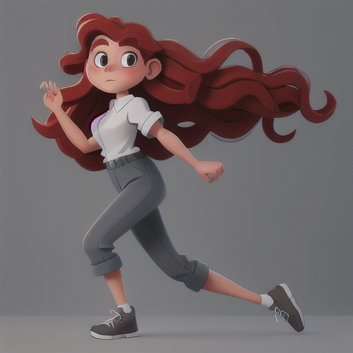
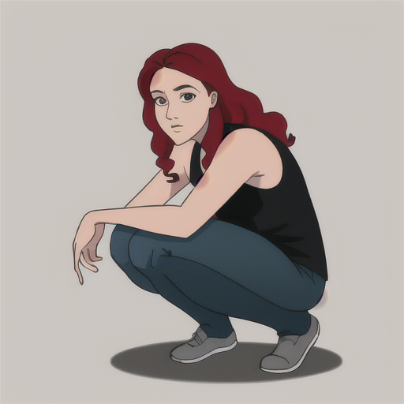

# Prompt Cheatsheet: Postures Across AI Models

**Template**: `photorealistic, soft lighting, full body, 8k resolution, 25yo woman, attractive, gray eyes, long curly red hair,  natural face, neutral expression, balanced proportions, clean background, <<positive>>`

---

| Posture | [Photon X EpicRealism](https://civitai.com/models/652785/photon-x-epicrealism) | [Anime Anything](https://civitai.com/models/113841/animeanything-or) | [Cute Cartoon Illustration](https://civitai.com/models/85547/cute-cartoon-illustration) | [Western Cartoon Type A](https://civitai.com/models/62060/western-cartoon-type-a) |
|----------|:--------:|:--------:|:--------:|:--------:|
| Standing_upright  Description: `A confident, straight-backed upright standing posture.` Keywords: `((standing upright)), good posture, confident stance` |  |  |  |  |
| Crossed_arms  Description: `Arms crossed across the chest, often implying confidence or defensiveness.` Keywords: `((arms crossed)), defensive stance, self-assured` |  |  |  |  |
| Hands_on_hips  Description: `Hands placed firmly on hips, conveying power or assertiveness.` Keywords: `((hands on hips)), assertive posture, confident` |  |  |  |  |
| Leaning_forward  Description: `A forward-leaning posture indicating attentiveness or engagement.` Keywords: `((leaning forward)), interested, engaged posture` |  |  |  |  |
| Leaning_back  Description: `A laid-back posture with the body leaning backward.` Keywords: `((leaning back)), relaxed, casual` |  |  |  |  |
| Hands_in_pockets  Description: `A casual and relaxed stance with hands placed in pockets.` Keywords: `((hands in pockets)), relaxed posture, casual` |  |  |  |  |
| Arms_spread  Description: `An open and expansive arm gesture implying welcome or confidence.` Keywords: `((arms spread)), welcoming gesture, open posture` |  |  |  |  |
| Arms_down  Description: `Arms relaxed and down by the sides, indicating calmness.` Keywords: `((arms relaxed at sides)), neutral, calm posture` |  |  |  |  |
| Sitting_straight  Description: `A proper sitting posture with a straight back.` Keywords: `((sitting upright)), good posture, alert` |  |  |  |  |
| Sitting_crosslegged  Description: `A relaxed sitting posture with legs crossed at the ankles or knees.` Keywords: `((sitting cross-legged)), relaxed, informal pose` |  |  |  |  |
| Hands_clasped  Description: `Hands joined in front or behind, often showing formality or humility.` Keywords: `((hands clasped together)), polite, respectful` |  |  |  |  |
| Kneeling  Description: `Kneeling on one or both knees, implying reverence or vulnerability.` Keywords: `((kneeling)), humble posture, prayer, submission` |  |  |  |  |
| Lying_on_back  Description: `A prone posture, lying back with relaxed limbs.` Keywords: `((lying on back)), relaxed, at rest` |  |  |  |  |
| Lying_on_side  Description: `A relaxed sideways lying position.` Keywords: `((lying on side)), casual, intimate pose` |  |  |  |  |
| Arched_back  Description: `A curving of the back often used in expressive or dramatic poses.` Keywords: `((arched back)), dynamic posture, tension` |  |  |  |  |
| Back_turned  Description: `A figure shown from behind, creating a sense of mystery.` Keywords: `((back turned)), facing away, mysterious posture` |  |  |  |  |
| Walking_forward  Description: `Dynamic posture showing forward walking motion.` Keywords: `((walking forward)), movement, progression` |  |  |  |  |
| Reaching_out  Description: `Arm extended as if to touch or grab something.` Keywords: `((reaching out)), stretching arm, inviting` |  |  |  |  |
| Crouching  Description: `A compact and low-to-ground posture.` Keywords: `((crouching)), low posture, tense` |  |  |  |  |
| Dancing_pose  Description: `An energetic and expressive dance pose.` Keywords: `((dancing posture)), joyful, expressive` |  |  |  |  |